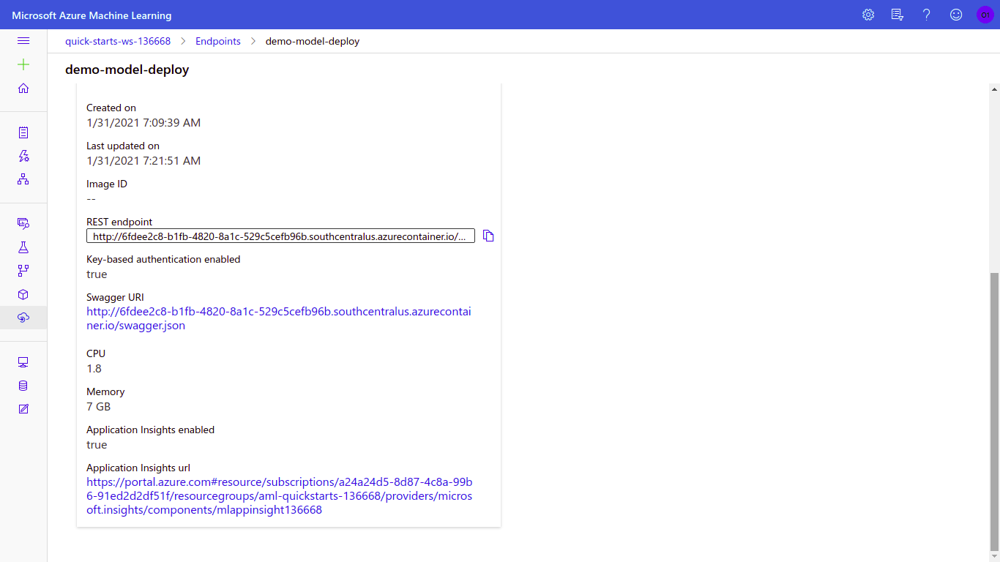
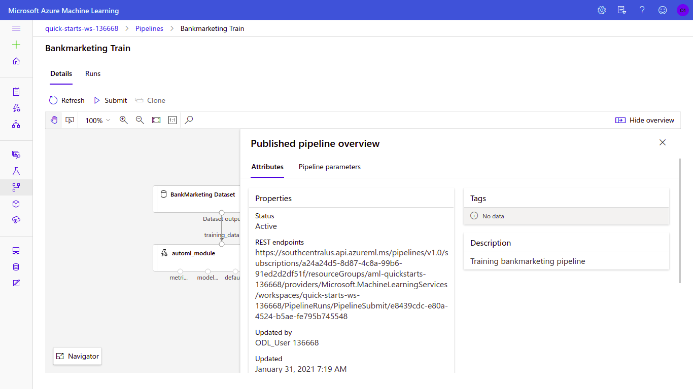

# Operationalizing Machine Learning

This project is part of the Udacity Azure ML Nanodegree. In this project, we first learn to deploy the best model of an AutoML run, enable insights on, create documentation for and consume the resultant endpoint. Additionally, we also create, publish and consume a machine learning pipeline with an AutoML step using the Python SDK for Azure.

## Architectural Diagram


## Key Steps

### Creating the Auto ML Model
First, we upload and register the Bank Marketing dataset on the Azure ML studio. 


Then, we proceed to initialize an AutoML run for building a classifier with the primary metric as Accuracy, exit criterion 1 hour and concurrency as 5.

 


 
As a result of this AutoML run, the best model we get MaxAbsScaler,XGBoostClassifier with accuracy 0.91958 and some other metrics as shown by the screenshots below.


### Deploying the best model
We use the Azure Container Instance deployment service of Azure ML Studio to deploy the best observed model of the AutoML run.After a while, the model is deployed and the endpoint becomes active.


### Enable logging Application Insights for Azure WebService
In order to do this, we run the ```logs.py``` file, where we update the name of the webservice to 'demo-model-deploy'.


As a result of doing this, we can observe that the application insights have been enabled for this deployment.


### Swagger Documentation
To enable swagger documentation, we first access the swagger URI from the Details tab of the deployed endpoint.



If we visit this URI, we can find the '''swagger.json''' file. Next, we download this '''swagger.json''' to the swagger directory of the project folder.
Next, we run '''serve.py''' to serve the '''swagger.json''' on a simple HTTP server at port 8000, and swagger.sh to download the latest Swagger container, and run it on port 9000.
Once that is done, we can browse to http://localhost:9000/ to find the swagger container. Here, we enter the URL for '''swagger.json''' being served (http://localhost:8000/swagger.json) to generate documentation for our endpoint.


### Consume model endpoints
To consume model endpoint, we run the '''endpoint.py''' file by modifying the scoring URI and authentication key. We get results that look like the following - 


**Benchmarking the endpoint**
We benchmark the endpoint using Apache bench to load-test our model. In order to do so, we execute '''benchmark.sh''' after updating the URI and and key. The results are as follows-


### Create and publish a pipeline
We get the same Bank Marketing Dataset and define a pipeline with an automl step for training our data. Once that is done, we publish the pipeline.





## Screen Recording
A screen recording of the project in action:
https://youtu.be/PkplHmVNjNs

Subtitles file (srt) can be found at <a href=
'https://github.com/alihussainia/Azure2/blob/master/subtitles.srt'>Subtitles.srt</a>

## Standout Suggestions Attempted
The project attempted to load-test the deployed model by utilizing the capabilities of Apache Benchmark.

## Future Improvements
* We can work on data cleaning, preprocessing and some feature engineering for the Bank Marketing Dataset.
* We can perform outlier detection.
* The classification AutoML task can include deep learning techniques to achieve better results.
* We can add a parallel run step to our pipeline. This might help in reducing the processing time.
